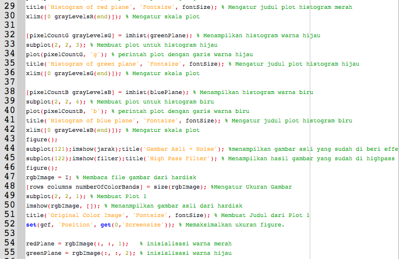

# TUGAS KELPMPOK 5

- Egyn Terescova Nadia
- Nurhaliza
- Risma Wulandari

## FILTER

## Low Pass Filtering

Low-pass filtering adalah proses filter yang melewatkan komponen citra dengan nilai intensitas yang rendah dan meredam komponen citra dengan nilai intensitas yang tinggi. 
LPF (Low Pass Filter) atau disebut juga smoothing filter merupakan salah satu metode untuk menghilangkan noise acak, noise berkala, dan menampilkan pola latar belakang.  
Fungsi dasar dari low-pass filter yang ideal adalah untuk memperkirakan rata-rata sebuah piksel dan semua piksel tetangga dan akhirnya mengganti nilai asli dari piksel tersebut.  
Low pass filter diterapkan untuk menghasilkan citra yang lebih halus dan lebih blur. 

Aturan kernel untuk low-pass filter adalah: 
1. Semua koefisien kernel harus positif. 
2. Jumlah semua koefisien kernel harus sama dengan 1. 

Contoh kernel yang dapat digunakan pada <b>low-pass filtering</b> adalah

## High Pass Filtering

High Pass Filter (HPF) adalah proses filter yang mengambil citra dengan gradiasi intensitas yang tinggi dan perbedaan intensitas yang rendah akan dikurangi atau dibuang. High Pass Filtering adalah salah satu dari metode penajaman (sharpening). 
Tujuan utama dari proses penajaman ini adalah untuk menyoroti detail-detail halus dalam gambar atau untuk meningkatkan detail yang telah dikaburkan baik dalam kesalahan atau efek alami dari proses akuisisi citra tertentu.

Aturan kernel untuk high-pass filter adalah: 
1. Koefisien penapis boleh negatif, nol, ataupun bernillai positif. 
2. Total keseluruhan koefisiennya ialah bernilai 0 ataupun 1. 
3. Apabila jumlah koefisiennya berjumlah = 0, maka setiap elemen yang rendah frekuensinya nilainya akan menurun.  
4. Namun, apabila total dari koefisien adalah = 1, maka elemen yang memiliki frekuensi rendah nilainya tetap sama dengan nilai semula.

### Implementasi High Pass Filtering menggunakan Octave
1. Kode Program Manual
   
   
   

 

2. Kode Program yang Tersedia di Octave
   

   - Kernel 1
       

   - Kernel 2
       

   - Kernel 3
       

   - Kernel 4
       

   - Kernel 5
       

   - Kernel 6
       

## High Boost Filtering

High-Boost Filtering merupakan salah satu bagian dari operasi yang dapat dilakukan untuk melakukan perbaikan citra. 
High-Boost Filtering bertujuan untuk menekankan komponen frekuensi tinggi yang mewakili detail gambar tanpa menghilangkan komponen frekuensi rendah (seperti sharpening). Filter high boost dapat digunakan untuk mengubah komponen frekuensi tinggi. 
High boost filter disusun oleh semua pass filter dan edge detection filter (Laplacian filter). Dengan demikian,  High boost filtering menekankan  edge dan menghasilkan image sharpener.

cara menghitung: 
Highboost = a Original – Lowpass

       = (a – 1) Original + Original – Lowpass

       = (a – 1) Original + Highpass

Jika a = 1, kita mendapatkan unsharp masking. 
Jika a >1, bagian citra original ditambahkan kembali ke citra hasil high pass filter. Highboost = (a – 1) Original + Highpass 

ilustrasi dari High Boost Filtering 

## Median Filtering

Median Filtering adalah salah satu teknik filter yang mengurutkan nilai intensitas sekelompok pixel, kemudian mengganti nilai pixel yang diproses dengan nilai mediannya (nilai tengahnya). 
Metode ini digunakan dalam penghalusan citra (image smoothing) atau menghilangkan derau noise. Filter ini merupakan suatu filter non linear yang dikembangkan oleh Tukey.

Algoritma dari Median Filtering 

- Memasukkan dan membaca image / gambar untuk dapat diproses
- Penentuan mask filter tersebut. Bisa 3x3 atau 5x5
- Mengurutkan nilai pixel dari nilai pixel terkecil ke terbesar
- Tentukan mediannya
- Mengubah nilai tengah pixel dengan nilai median yang telah ditemukan
- Proses diatas berulang hingga ke piksel terakhir citra
- Menampilkan gambar berupa perbandingan sebelum dan sesudah di filter

